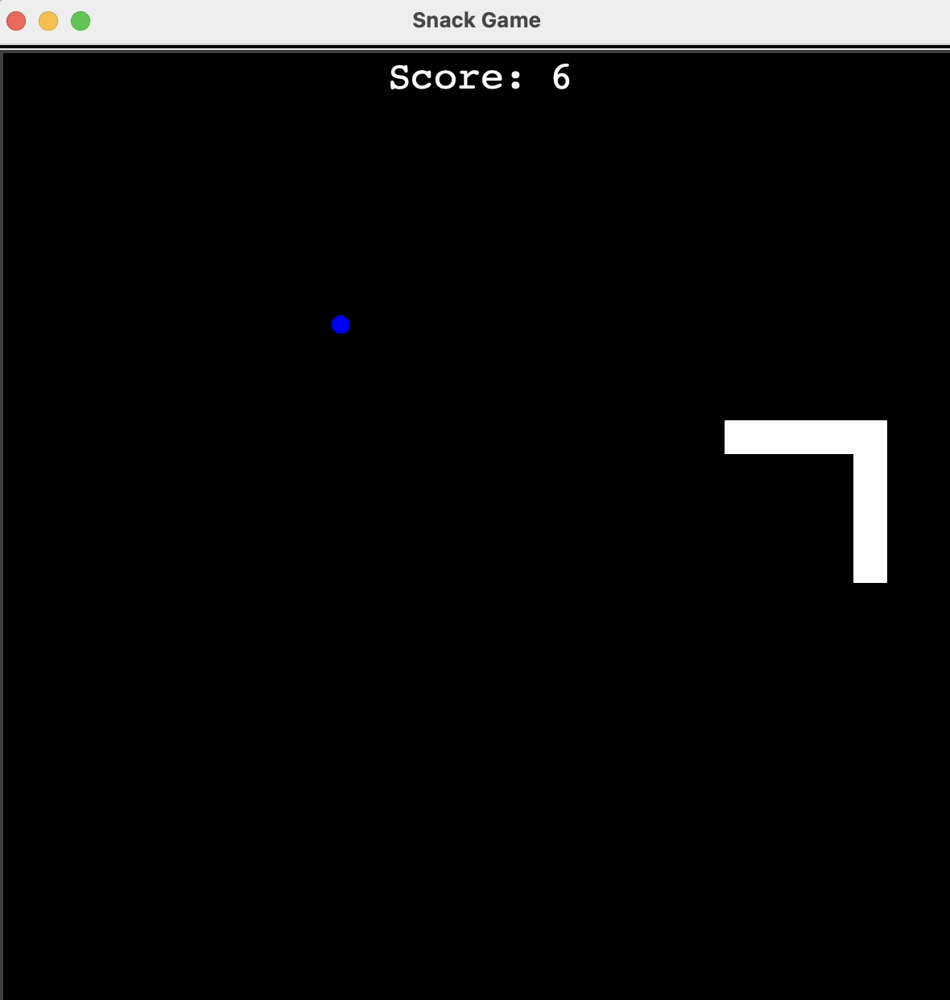
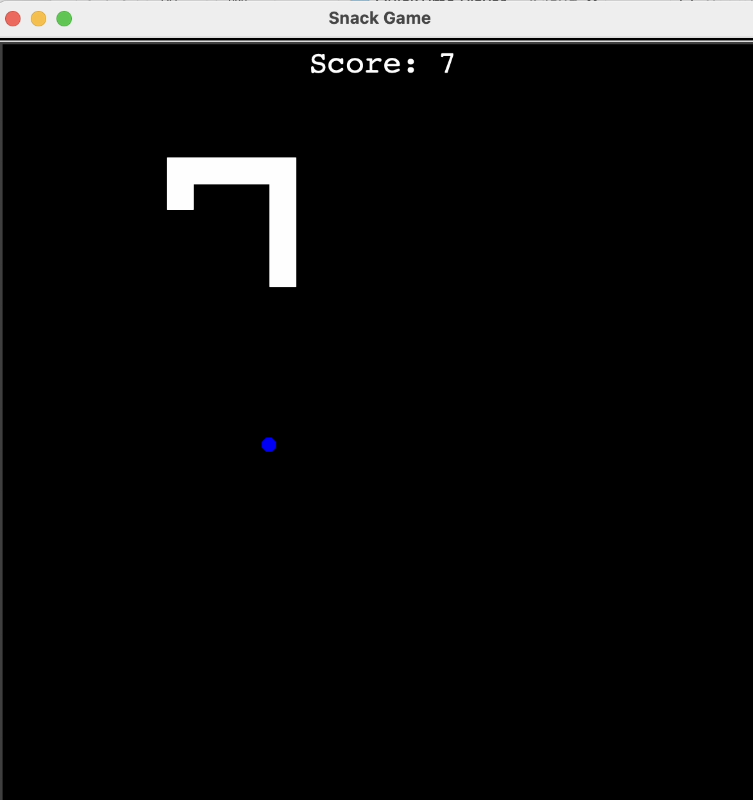
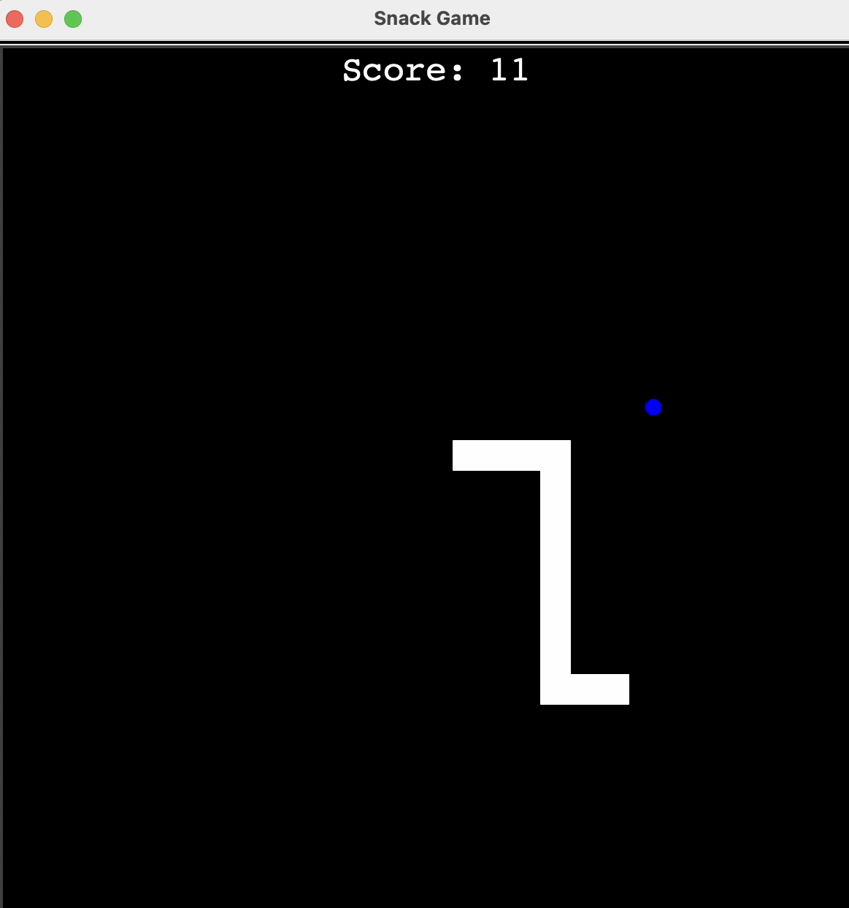
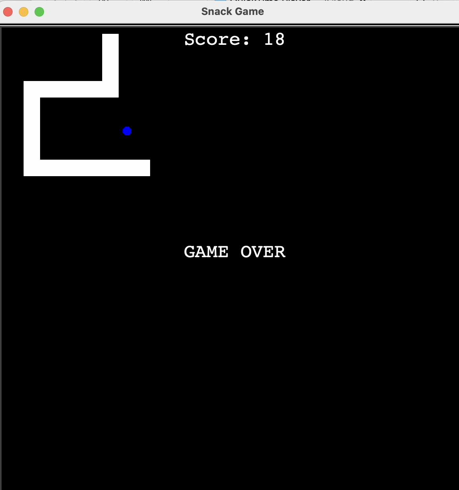

# Snake Game

## Overview

This is a classic Snake game implemented in Python using the `turtle` graphics library. The player controls a snake, navigating it to eat food and grow longer, while avoiding collisions with the walls and its own tail.

## Images

## How to Run

To play the game, you need to have Python installed on your system.

1. Save all the files (`main.py`, `agents/food.py`, `agents/scoreboard.py`, `agents/snake.py`) in the same directory.
2. Open a terminal or command prompt and navigate to the directory where you saved the files.
3. Run the command: `python main.py`

The game window will open, and you can control the snake using the Up, Down, Left, and Right arrow keys.

## Game Logic

The game revolves around the following components:

*   **Snake:** The player-controlled entity that moves around the screen. It grows longer each time it eats food.
*   **Food:** A randomly placed object that the snake needs to eat to increase its score and length.
*   **Scoreboard:** Keeps track of the player's score.

The game ends if the snake collides with the screen boundaries or its own tail.

## File Structure

*   `main.py`: This is the main script that initializes the game, sets up the screen, and contains the main game loop. It handles user input for controlling the snake and checks for game over conditions.
*   `agents/`: This directory contains the classes for different game elements.
    *   `food.py`: Defines the `Food` class, responsible for creating and positioning the food at random locations on the screen.
    *   `scoreboard.py`: Defines the `Scoreboard` class, which manages and displays the player's score, and handles the "Game Over" message.
    *   `snake.py`: Defines the `Snake` class, which manages the snake's body segments, movement, and direction control.

## Classes

### `Snake` (agents/snake.py)

*   `__init__`: Initializes the snake with a starting position and creates the initial segments.
*   `create_snake`: Creates the initial three segments of the snake.
*   `add_segment`: Adds a new segment to the snake.
*   `move`: Moves the snake forward by moving each segment to the position of the segment in front of it.
*   `up`, `down`, `left`, `right`: Change the direction of the snake's movement, preventing moving in the opposite direction.
*   `extend`: Adds a new segment to the end of the snake when it eats food.

### `Food` (agents/food.py)

*   `__init__`: Initializes the food as a small blue circle and places it at a random location.
*   `refresh`: Moves the food to a new random location on the screen.

### `Scoreboard` (agents/scoreboard.py)

*   `__init__`: Initializes the scoreboard, sets its color and position, and displays the initial score.
*   `update_scoreboard`: Writes the current score on the screen.
*   `increase_score`: Increments the score and updates the displayed score.
*   `game_over`: Displays the "GAME OVER" message on the screen.

## Dependencies

*   `turtle`: Python's built-in graphics library used for creating the game window and drawing the game elements.
*   `time`: Used to control the game speed.
*   `random`: Used to generate random positions for the food.
